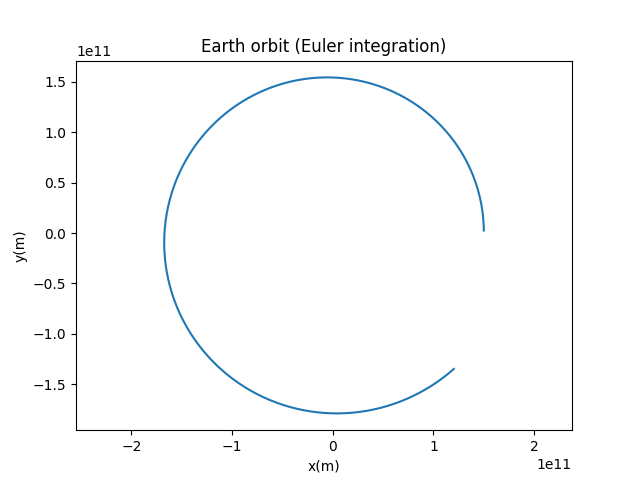
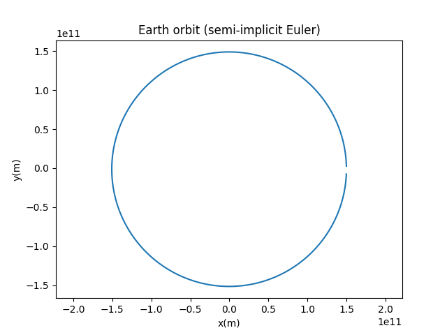
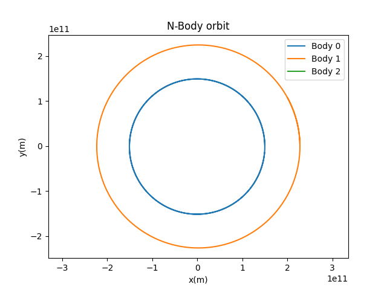
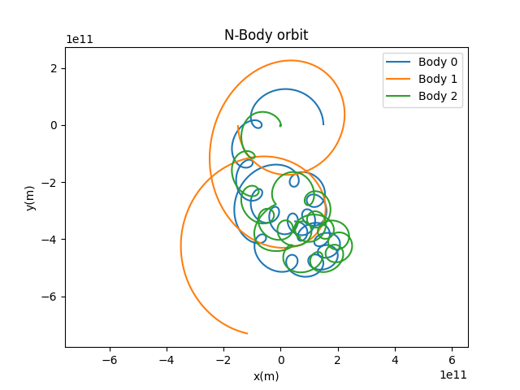
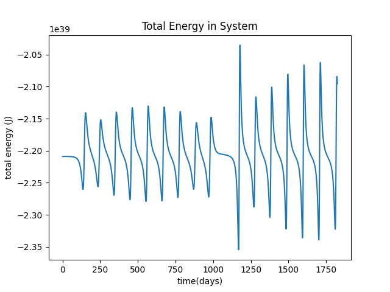

# N-Body Gravitational Simulator

A gravitational N-body simulator built from scratch in Python to explore numerical
integration methods, orbital mechanics, and energy conservation in chaotic systems.

I had a great time with this project and learned a lot. I absolutely love learning 
about physics and how the universe works at its most fundamental levels. It's likely I will come 
back to this and explore more in-depth methods and calculations to further optimize the simulation.

This project was built step-by-step to understand why certain numerical methods
are used in physics simulations. Each stage below intentionally includes a version 
that didn't work well or was unoptimized, before fixing it.

## Setup

```bash
python3 -m venv venv
source venv/bin/activate      # Windows: venv\Scripts\activate
pip install -r requirements.txt
python nbodysim.py
```

## Process & Findings

### 1. Two-body Euler integration
Started with a simple Earth-Sun system using explicit Euler integration
(update position using the *old* velocity, then update velocity).

Over one simulated year, the orbit visibly spirals outward just slightly instead of closing 
(although not visible, the Sun is present in the center of the graph and begins at (0,0)):



This happens because explicit Euler calculates acceleration at the start of each
step and assumes it stays constant for the whole step. Since gravity's direction
changes continuously as the body moves, this systematically injects a small amount
of extra energy into the system at every step, and the errors compound in one direction.

### 2. Semi-implicit Euler
Fixed by updating velocity *first*, then using the new velocity to update position.
This reordering makes the integrator symplectic it no longer drifts in one
direction, keeping the orbit's error bounded instead.



The orbit now closes correctly over one simulated year.

### 3. Generalizing to N bodies
Refactored from hardcoded Sun/Earth variables into a `Body` class and a list-based
structure, so any number of bodies can interact. Forces are calculated for every
pair using synchronous updates. All forces for the current timestep are computed
*before* any body's position or velocity is updated, so bodies interact based on a
consistent snapshot in time rather than partiallyupdated positions.

Validated against real orbital periods using a Sun-Earth-Mars system: simulating
exactly one Earth year left Mars mid-orbit (matching its known ~687-day period),
and extending to ~2 years closed Mars's orbit as expected.



### 4. Chaotic three-body system
Replaced the "Sun-dominated" setup with three bodies of comparable mass, producing chaotic dynamics. We now observe tight loops, close encounters, and unpredictable
trajectories, in contrast to the clean almost circular orbits of a "Sun-dominated" system.



### 5. Energy conservation diagnostic
Added a diagnostic tracking total system energy (kinetic + potential) at each
timestep, since true energy conservation is a real physical law. Any drift
observed is purely numerical error from the integration method.



The plot shows the total energy oscillating within some range but with sharp spikes likely during close encounters between
bodies. This is because potential energy scales as `-1/r`, so it grows very
large in magnitude as bodies pass close to each other and a fixed timestep
can't accurately capture the rapid force changes during a fast close encounter.
After some research, I learned that this is a known limitation of fixed-timestep integrators, and a real motivation
for using better integrators like adaptive timestepping in more complicated N-body codes.
Some more integrators I found to be interesting and prevalent:
- Proper leapfrog integration for better energy conservation
- Barnes-Hut tree algorithm for scaling to larger numbers of bodies

## Tech
Python, NumPy, Matplotlib
